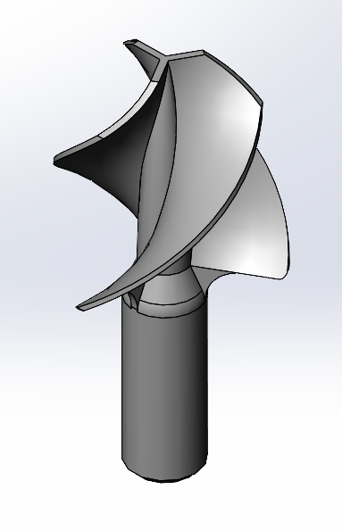

# Wess
A Tool designed to remove coffee marc from your Nespresso capsules.
Designed using Solidworks 2021.

## How to use it

Mount directly this tool on your drill, then crunch the coffee marc out of the capsule by the soft side.

## License

Licensed under GPLv3
